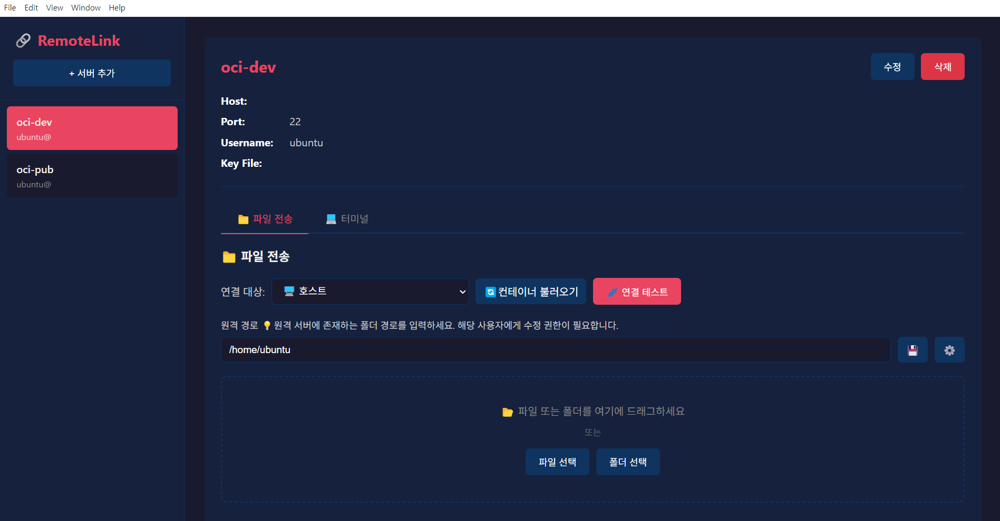
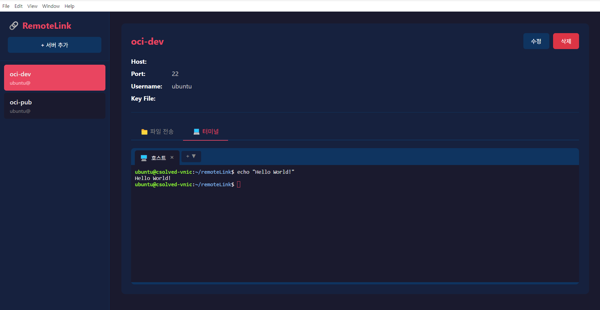

# RemoteLink

SSH/SFTP 기반 원격 서버 파일 전송 및 실시간 터미널 도구


## 소개

RemoteLink는 여러 원격 서버를 관리하고, 파일/폴더를 전송하며, 실시간 터미널로 통신할 수 있는 데스크톱 애플리케이션입니다.

### 주요 기능

- **서버 관리**: 여러 SSH 서버 정보를 등록하고 관리
- **파일 전송**: 드래그 앤 드롭으로 파일/폴더를 원격 서버로 전송
- **Docker 지원**: 호스트뿐만 아니라 Docker 컨테이너 내부로 직접 파일 전송
- **실시간 터미널**: SSH 호스트 및 Docker 컨테이너에 대화형 터미널 연결
- **SSH 키 인증**: PEM, KEY 등 다양한 SSH 키 파일 지원

## 스크린샷

### 파일 전송 화면


### 터미널 화면


## 설치

### 다운로드 (권장)

[Releases](https://github.com/dyl0115/RemoteLink/releases/tag/v1.0.0) 페이지에서 최신 버전을 다운로드하세요.

| 플랫폼 | 파일 |
|--------|------|
| Windows | `Remote.Link.Setup.1.0.0.exe` |

### 소스에서 빌드

직접 빌드하려면 Node.js 18 이상이 필요합니다.

```bash
# 저장소 클론
git clone https://github.com/your-username/remoteLink.git
cd remoteLink

# 의존성 설치
npm install

# 개발 모드 실행
npm start

# 빌드
npm run build:win    # Windows
npm run build:mac    # macOS (호환성 문제가 발생할 수 있음)
npm run build:linux  # Linux (호환성 문제가 발생할 수 있음)
```

## 사용법

### 1. 서버 등록

1. `+ 서버 추가` 버튼 클릭
2. 서버 정보 입력:
   - 서버 이름 (표시용)
   - Host (IP 주소)
   - Port (기본값: 22)
   - Username
   - SSH Key 파일 경로
3. `저장` 클릭

### 2. 파일 전송

1. 왼쪽 목록에서 서버 선택
2. 연결 대상 선택 (호스트 또는 Docker 컨테이너)
3. `연결 테스트`로 연결 확인
4. 원격 경로 입력 (예: `/home/ubuntu/app`)
5. 파일/폴더를 드래그 앤 드롭 또는 버튼으로 선택
6. `전송 시작` 클릭

### 3. 터미널 사용

1. `터미널` 탭 클릭
2. `+` 버튼으로 새 터미널 열기
3. 호스트 또는 Docker 컨테이너 선택
4. 실시간 명령어 실행

## 프로젝트 구조

```
remoteLink/
├── main.js                 # Electron 메인 프로세스
├── preload.js              # Context Bridge (보안 통신)
├── index.html              # UI 마크업
├── styles.css              # 스타일시트
│
├── renderer/               # Renderer 프로세스 (UI)
│   ├── index.js            # 앱 상태 관리
│   ├── serverListView.js   # 서버 목록 UI
│   ├── serverDetailView.js # 서버 상세 UI
│   ├── serverFormView.js   # 서버 추가/수정 폼
│   ├── fileTransferView.js # 파일 전송 UI
│   └── terminalView.js     # 터미널 UI
│
├── client/                 # 비즈니스 로직
│   ├── sshClient.js        # SSH 연결/전송
│   └── dockerClient.js     # Docker 컨테이너 관리
│
├── repository/             # 데이터 저장소
│   └── serverRepository.js # 서버 정보 CRUD (JSON)
│
└── shared/                 # 공통 모듈
    ├── errorCodes.js       # 에러 코드 상수
    ├── logger.js           # 로깅 시스템
    ├── pathUtils.js        # 경로 유틸리티
    ├── fileUtils.js        # 파일 유틸리티
    ├── sshConnection.js    # SSH 연결 공통
    └── terminalSession.js  # 터미널 세션 관리

```

## 기술 스택

| 분류 | 기술 |
|------|------|
| Framework | Electron 33 |
| Language | Vanilla JavaScript |
| SSH | ssh2 |
| Terminal | xterm.js |
| Build | electron-builder |

## 주요 특징

### 크로스 플랫폼 지원
- Windows, macOS, Linux에서 동일하게 동작
- 경로 처리 시 OS별 구분자 자동 처리

### 보안
- Context Isolation 활성화
- Node Integration 비활성화
- CSP(Content Security Policy) 적용
- SSH 키 파일 기반 인증

### Docker 통합
- 호스트의 Docker 컨테이너 목록 조회
- 컨테이너 내부로 직접 파일 전송
- 컨테이너 대화형 터미널 (docker exec -it)

### 폴더 전송
- 폴더 구조 유지하며 전송
- 필요한 디렉토리 자동 생성 (mkdir -p)
- 다중 파일 동시 선택

## 문제 해결

### 연결 실패
- SSH 키 파일 경로 확인
- 서버 IP/Port 확인
- 방화벽 설정 확인

### Docker 컨테이너 목록이 안 보임
- 호스트에 Docker 설치 확인
- SSH 사용자의 Docker 권한 확인 (`docker ps` 실행 가능 여부)

### 파일 전송 실패
- 원격 경로 존재 여부 확인
- 해당 경로에 쓰기 권한 확인

## 라이선스

MIT License
